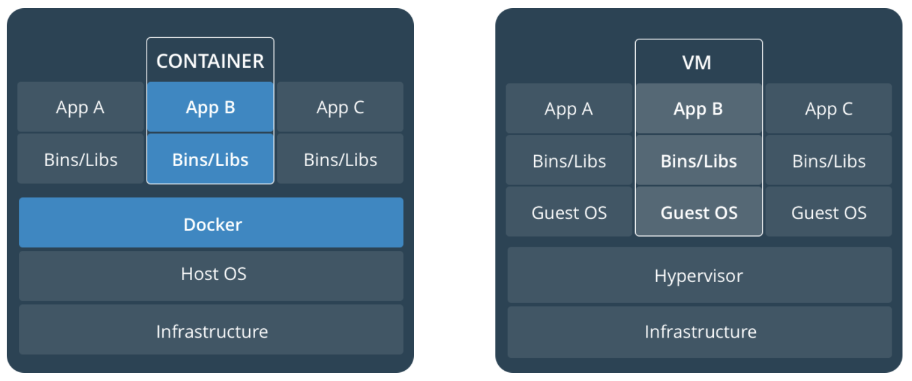
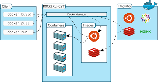
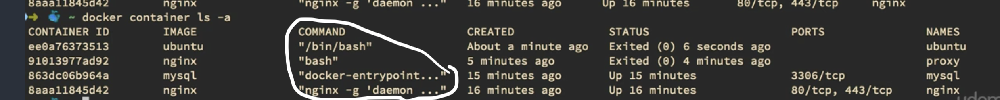
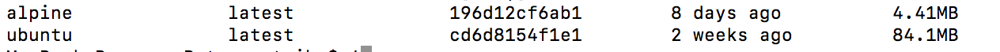
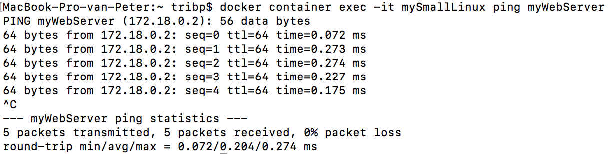
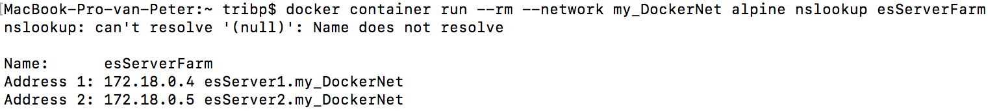
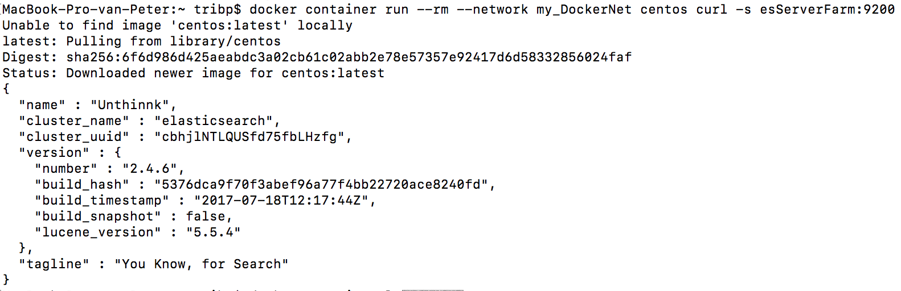

# Docker-Getting-Started

**TOC :**

    0. Intro 
    1. Basic commands
    2. Persistent Data: Volumes and bind mount
    3. Images
    4. Docker Hub
    5. Dockerfile
    6. Docker-compose
    7. Docker Hub

Architecture: docker vs VM  


Docker Components:  


## 0 Intro

* image = blueprint for the container instances
    * consists of:
        * app binaries + dependencies
        * metadata + how to run it (eg: metadata = docker image inspect alpine)
            * like: opened ports, env (PATH), CMD it will execute @start etc
* container = an 'instance' of image
* [docker hub](https://hub.docker.com) = internet repository for public and private docker images 

## 1 Basic commands

### 1.1 docker version

```
docker --version
Docker version 18.03.0-ce, build 0520e24
```

```
docker version
Client:
 Version:	18.03.0-ce
 API version:	1.37
 Go version:	go1.9.4
 Git commit:	0520e24
 Built:	Wed Mar 21 23:06:22 2018
 OS/Arch:	darwin/amd64
 Experimental:	false
 Orchestrator:	swarm

Server:
 Engine:
  Version:	18.03.0-ce
  API version:	1.37 (minimum version 1.12)
  Go version:	go1.9.4
  Git commit:	0520e24
  Built:	Wed Mar 21 23:14:32 2018
  OS/Arch:	linux/amd64
  Experimental:	true
```

### 1.2 docker info

```
docker info
```

### 1.3 List docker images

Lists all the docker images. An image a 'blueprint' of for the containers. On the other hand, a container will be an 'instance' of this image. Like a 'class' and a 'object' in programming. <br> So we can have multiple running container of the same unique image.

```
docker images ls            -> lists the 'local' images

```

### 1.4 List docker running containers

**remark: container = runtime instance of image**

```
docker ps                                   -> shows running container
docker container ls                         -> idem

docker container ls --all                   -> shows running + stopped containers
docker container ls -a                      -> idem

CONTAINER ID        IMAGE               COMMAND                  CREATED             STATUS              PORTS                                                      NAMES
cf82029d460a        cs50/ide            "node server.js -w /…"   2 weeks ago         Up 5 days           0.0.0.0:5050->5050/tcp, 0.0.0.0:8080-8082->8080-8082/tcp   ide50
```

### 1.5 Testing your docker setup.

```
docker run hello-world
```

### 1.6 Running a container from a image

**Important:** Docker run is shorthand for 'docker create + docker start'. This means that it will always create a new container instance!!! If we want to restart a already created container we must use 'docker start ...' 

```
docker container run -d -p 8080:80 --name myWebServer nginx
    -> -d = in'detatch' mode (as process)
    -> -p = map external port 8080 to internal port 80 inside container
    -> --name = give name
    -> nginx = name of image to use
```

**Remark:**

- a container must have at least 1 internal process in order to live. Otherwise it exits -> eg: docker container run ubuntu. (lots of Q on www :-)
- in case of a standard ubuntu container we need a proces, like bash to keep it alive. (in case of the 'myWebServer above, the webserver proces is)
- every container gets a 'id nr' (= interchangeble with the name in commands)
- the container has a 'startup' cmd but when ommited it is the default one.

```
docker container run -it -d ubuntu
            -> -i = 'interactive' = redirects the 'stdin' from the container to the bash
            -> -t = pseudo tty = bash
```

remark: we can :

- - 'docker container run -i ubuntu' -> here we will lack a shell to work properly
- - 'docker container run -t ubuntu' -> here we have a shell but no cmds because no linked 'stdin'

```
docker container run -it --name myubuntu ubuntu             -> default cmd = '/bin/bash'
docker container run -it --name myubuntu ubuntu /bin/bash   -> == equal

docker container run -it --name myubuntu ubuntu
docker container run -it ubuntu                             -> container gets a random name
```

### 1.6 Analyze containers

```
docker container top myWebServer        -> shows processes inside my container
docker container inspect myWebServer    -> shows docker config file (json) for this container
docker container stats                  -> shows overall performance of all my containers
docker container stats myWenServer      -> shows performance details of my container

```

### 1.7 starting CLI inside of container

    2 options:

    a. We launch a **new** container together with a shell. But when cli is killed, so is the container!

    docker container run -it ... -> start a new container interactively in the same process.
        if we leave CLI then container stops !!!


    b. We already have a running container and 'attach' one or more cli's independent from it.

        (or we create and run a new container (in detach mode see -d)) 
                -> docker container run -dit --name myubuntu ubuntu
        (or we restart a stopped container: if so 'myubuntu' will be listed when (docker container ls -a))
                -> docker container start myubuntu

        docker container exec -it myubuntu sh -> starts a cli on running container in ADDITIONAL process.
        if we leace CLI then CLI stops but container continues !!!

```
docker container exec -it myWebServer sh
    -> exec = execute command
    -> -i = interactive (stay open)
    -> -t = tty
    -> sh = shell command in nginx because there is no 'bash'

```

In case we have a existing but stopped container and want to restart it (non detached) and want to have a bash during its liftime. Note that this container must have 

```docker
docker start -ai mytempServer
```

### 1.8 (Default) launch command



### 1.9 Different Linux Distros.

Most minimal = 'alpine' -> we have to install everything we need additionally wit APK packege manager

docker container run it --name mySmallLinux alpine sh docker container run it --name myUbuntu ubuntu bash



Next we have to add the things we need in alpine: eg 'curl'

```
docker pull alpine                                          -> pulls latest image of alpine
docker container run -it --name mySmallLinux alpine sh      -> start container + shell
(now in alpine prompt)
apk add curl                                                -> add curl to the (tiny) linux distro
```

### 1.10 stopping and deleting

First we have to 'stop' a container before we can delete them 

```
docker container stop ec8                   -> if eg ID=ec8532baxx etc (only first digits if unique)
or
docker container stop mySmallLinux
docker container rm mySmallLinux
```

#### Remark:

We can launch execute and delete (--rm) a container. This way nothing remains to be cleand-up.!!!

eg: Here we launch a linux 'centos' container, connect in into network my_DockerNet, and execute a curl command. This example queries a elasticsearch instance on port 9200.

```
docker container run --rm --network my_DockerNet centos curl -s esServerFarm:9200
```

### 1.11 Docker Networks

```
docker network ls
docker network inspect                                  -> returns json with network info and connected containers
docker network --create driver
docker network connect [options] NETWORK CONTAINER      -> connect CONTAINER to this NETWORK
docker network disconnect
```

Ping between containers

We perform a usual 'docker container exec -it' (to start new process where next cmd will be run) + container Name + command.

### Remark:

DNS is default enabled with all custom networks but NOT at default 'bridge' network. Best practise = create allways your own network(s)

```
docker container exec -it mySmallLinux ping myWebServer
```



#### 1.11.1 Docker DNS - network alias - round robin

We create 2 different servers (containres) but with the same '--network-alias'. This way DNS will resolve, round robin wise' each server ip address and creates some kind oh high availability.

''' docker container run -d --name esServer1 elasticsearch:5.6 --network my_DockerNet --network-alias esCloudServer '''

#### 1.11.2 Excercise:

- Make two elasticsearch containers (version 2) in network 'my_DockerNet' and both with network-alias = 'esServerFarm'
- launch a linux 'alpine' container and execute 'nslookup esServerFarm' to check resolving both ip's and -rrm (to clean-up)
- launch a 'centos' linux (also with --rm) and execute 'curl -s esServerFarm:9200' to check elasticsearch functionality.

```
docker container run -itd --name esServer1 --network my_DockerNet --network-alias esServerFarm elasticsearch:2
docker container run -itd --name esServer1 --network my_DockerNet --network-alias esServerFarm elasticsearch:2
docker container run --rm -it --network my_DockerNet alpine nslookup esServerFarm
docker container run --rm -it --network my_DockerNet centos curl -s esServerFarm:9200
```





#### 1.12 Entrypoint - CMD and arguments

- **Entrypoint** = is always executed and 'arguments' in docker run -> will be **appended**

```docker
#suppose you made a ubuntu version with ENTRYPOINT = sleep (image name:ubuntu-sleep)
# will be == docker run --entrypoint sleep ubuntu 10
# 10 = argument and will replace CMD
docker run ubuntu-sleep 10
```
- **CMD** = is what will be run by default OR when arguments in docker run -> will be **overwritten**

```docker
# official ubuntu has: CMD = ["/bin/bash"]
# Here argument 'sh' will overwrite default '/bin/bash' with shell 'sh'
docker run ubuntu sh
```

[commands vs entrypoints](https://www.youtube.com/watch?v=OYbEWUbmk90)

## 2 Persistent Data: Volumes and bind mount

intro: Containers are:

    - immutable
    - ephemeral = only temporarly (short live: new ones regularly drive out the old)
    - are used for 'immutable infrastructure: we never upgrade or change containers, we re-deploy !

### 2.1 What are Volumes and bind mounts

**Volumes:**

- ideal for production
- can be used in Dockerfile, in cmd-line (-v) and with 'docker volume create.
- is optional but indispendable when needing persisten data.
- creates location outside the container UFS -Union File System
- host path = linux (virtual host path): '/var/lib/docker/volumes/..'

  -> no 'one 2 one' mapping in case of MAC/PC !!

**bind mounts:**

- ideal for local development on your Mac/PC
- maps host(Mac) dir to container inside dir
- alternative + less need for bash shell to change files
- can NOT be used in Dockerfile !!!
- Path MUST start with '/' otherwise it is a volume ( -v /...:/...)
- sharing or mounting a host dir or file into a container

Volumes gives us 'persistent data' by 'attaching' a volume to a container, comparable with the use of a 'Hard disk'. This is achieved by 'mappingg' a external (sub)directory to a (mostly data) directory of the container.

A standard container, withou the use of a volume, will save all data within the container. Stoppin and restarting is no problem but when deleting a container, the data will also be lost !

Why using Volumes ?

    - decoupling container from storage
    - Share volume and data between differenet containers
    - we can 'attach' a volume to a container
    - we can delete container but volume (and data :-) will persist.

```
docker volume ls            -> list all existing volumes
```

### 2.2 How to create / list / delete volumes

```
docker volume create myDockerVolume1  ->
docker volume inspect myDockerVolume1   -> gives details (but not the containers that use it)
docker volume rm myDockerVolume         -> deletes volume
docker volume prune                     -> will delete all unused volumes
```

### 2.3 How to attach volume to a container

```
docker run -d -p 8080:80 -v myDockerVolume1:/usr/share/nginx/html --name myWebServer nginx
        -> -d = detach -> so container runs in background
        -> -p = map external port 8080 to internal container port 80 (=web)
        -> -v external vol: internal vol

docker run -d -p 8080:80 -v /Users/tribp/Data/myDockerData/myWebServer1:/usr/share/nginx/html --name myWebServer1 nginx
```

Now all the data in the container '/usr/share/nginx/html', we wil see it on our Mac

### 2.4 How to share volume between containers

### 2.5 What are bind mounts

## 3 Images

### 3.1 Image basics

```
What is an image ?
    - app binaries and dependencies
    - metadate about the image and how to run it
```

### 3.2 Image layers

```
docker history nginx                    -> shows the layered changes in time of the image
docker image inspact nginx              -> shows json metadata
```

    - every layers has his unique SHA
    - every layer exits only ONCE, even if multiple image use that same layer
        eg: an image of a ubuntu + apt + apache AND an other image ubuntu + apt + mysql. While downloading the second image will only download mysql since ubuntu + apt is already present in an other image. The SHA ensures that we refer to exactly the correct and unique immage.

### 3.3 Conclusion

    - images are made up of file system changes and metadata
    - each layer is uniquely identified and only stored ONCE on a host
    - this saves stores space on host and transfer time push/pull
    - a container is just a single read/write layer on top of image.

## 4 Docker hub

### 4.1 intro

    - 'official' images like 'nginx'
    - 'unofficial' = username / image_name  -> eg tribp/nginx

### 4.2 tags

    - add it manually or default = 'latest'
    - docker image tag SOURCE_IMAGE[:TAG] TARGET_IMAGE[:TAG]
        eg: docker image tag nginx tribp/nginx:testing

### 4.3 pushin to Docker Hub

```docker
docker push tribp/myNewImageProject
```

### 4.3 Login-out to docker hub

### remark:

    - cat .docker.config.json       -> login key is added !! -> be sure to log out on untrusted host
    - docker login
    - docker logout

### 4.4 push / pull

Docker hub works similar to GitHub.

```
    - docker image push tribp/nginx
```

### remark:

if we want private images, we first have to create a private respository on the docker hub account and push your image.

### Building images

```

```

## 5 Dockerfile

A docker is used to **build** (your own) **images**.

Mostly you start **FROM** a base image and you add layers on top. Each layer becomes a new 'image' with its own ID. Every unique images is only stored once.

If you adapt or add functionality and create a new image, then all 'untouched' or existing (sub)layers will only reference the existing (sub)images and only create new ID's or images for what is changed.

So it is important that you 'layer' in in an optimal order, that layers that the less frequently you change layers, the lower they must be on the stack.

example:
```dockerfile
FROM node:6-alpine
RUN apk add --update tini &&\
  mkdir -p /usr/src/app
EXPOSE 3000
WORKDIR /usr/src/app
COPY package.json .
RUN  npm install &&\
  npm cache clean --force
COPY . .  
CMD ["/sbin/tini", "--", "node", "./bin/www"]
```
**Remark:**
* && and ; can both be used but:
    * && is conditional. Meaning that second command is only executed if first is successfull.
    * ; will execute also next cmd. Even if former failed ! So && is prefered.

## Handy commands - system Clean-up

```docker
docker sytem df             -> shows occuppied resources and overview
docker image prune          -> deletes 'dangling' images = no relationship / loose
docker system prune         -> clean up everything
docker system prune -a      -> clean up unused images
```
```docker
# for containers
docker rm myContainer
docker rm $(docker ps -aq)  -> -a = all -q=quit so return only ID in order to understand the delete
# for Images
docker rmi myImage
docker rmi $(docker images -q) -> deletes all images
```


## 6 Docker-compose

Docker-compose uses 'yaml' files for describing how to configure and **deploy** multi-**container** applications

## 7 Docker Hub

Docker Hub, (hub.docker.com)[hub.docker.com], is a public repository for docker images, offered by docker. 

This can be used in 2 ways:
    - to automatically retrieve popular docker images
    - to create your personal or special images and mage them publically available. 

### 7.1 To retrieve popular docker images.

In order to use this functionality, you do not need to create a login/password. When you specify a image:
    - manually with "docker run ..." (eg: docker container run --name web_server -d -p 8080:80 nginx)
    - in a dockerfile: 'FROM nginx:latest .....'
    - in a docker-compose.yaml file:  'image: openhab/openhab:2.5.5 ....'
docker will first look locally to find the image, but if not, it will automaticaly start looking into the public dockerhub repository in order to find it and download it.

### 7.2 To create your personal images

**Step 1:** Create a login and password on hub.docker.com
**Step 2:** Create your own image from a dockerfile
    - "docker build -t my_user_name/my_image:version ."
**Step 3:** Upload your image to the dockerhub repository

example
```
docker build -t openmeter/dsmr_fluvius:0.9 . 
docker login --username=openmeter 
docker push openmeter/dsmr_fluvius:0.9
```

