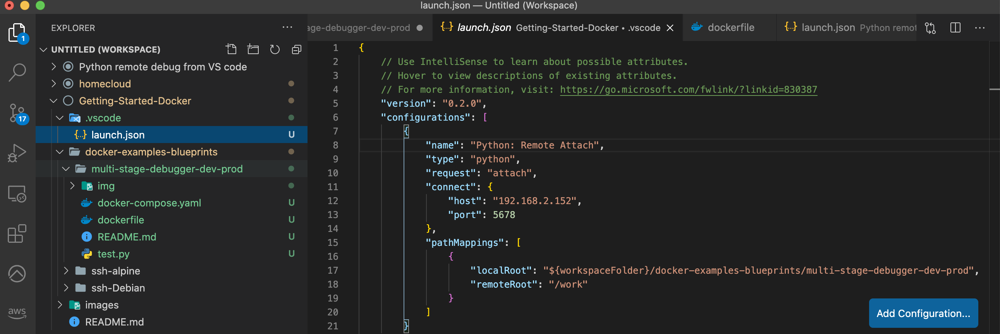

# VScode Remote Attach + multistage dockerfile

This example combines two principles in on example:

-   How to make a multi-stage dockerfile
-   How to debug remotely with **VScode Remote Attach**

## 1. Multi-stage dockefiles

**Goal:** is to make 1 single dockerfile that we can use for multiple purposes. Eg: a single file that contains our 'dev settings' **AND** our 'production settings'. This instead of having 2 seperate files. 

**Subsequently** we 'target', meaning choose, what conatiner to create in the 'docker-compose.yaml" file. 

In the example dockerfile, we first define a first stage 'base'. This will contain the common things we need in 'develepment' and in 'production'. 

From this 'base' we define 2 different variants, 'development' and 'production', each containing the specific things. 

Finally we choose what to create by pointing in the **docker-compose.yaml**, by the keyword 'target' the desired build respectively: 'development' or 'production'

[docker-compose.yaml](./docker-compose.yaml)

## 2. VScode Remote Attach

**General:** 

We can achieve 'remote debugging' in various ways. One way is by connecting your IDE of your Mac over SSH to de remote host. (see ssh-Debian example).

A second way to achieve it is by 'wrapping' the remote program with a specific debug wrapper (debugpy) and 'attaching' your IDE on your Mac to this remote 'wrapper'.

**Principle:**
- we wrap our remote python program with 'debugpy'
    - see: **python -m debugpy --listen 0.0.0.0:5678 --wait-for-client -m test.py**
    - typically this will be a python program running in a remote container on a remote machine. 
    - 0.0.0.0:5678 -> this instrcuts debugpy to the localhost, the remote container, to listen on port 5678
- we tell it to "wait" until our IDE (on our PC/Mac) connects to it and gets (debug) instructions: start / step / stop etc

- install the VScode extension. 

- create a 'lauch.json' in the '.vscode' directory with:
    - program language: python, node,..
    - IP of remote host
    - IP-port of remote host to connect to (eg: 5678)
    - Pathmappings of host (Mac) to remote (container)

- start debug