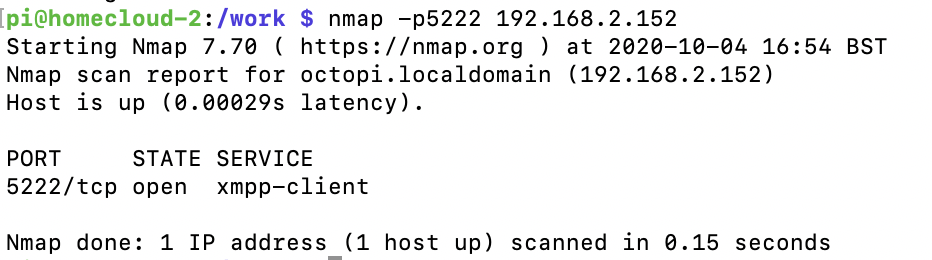
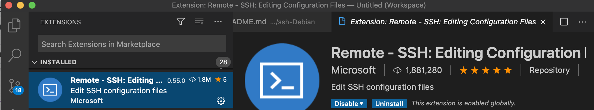
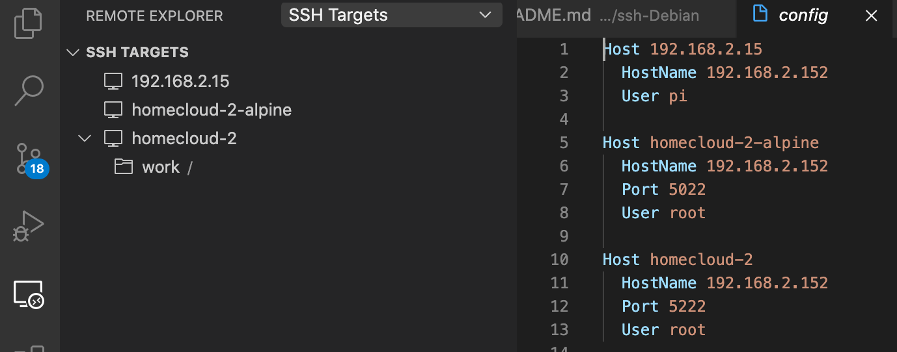

# Debian Buster container with SSH

## 1. Intro and why ?

Normally we don't need ssh in a container because:
- typically a container runs 1 process = his task it has to perform
- we  can use  "docker exec -it my_container_name /bin/sh"

## 2. VScode remote development with ssh

In VScode we can use the extension "Remote-SSH", login via VScode into a remote container and debug code running inside this container.

Problem:

VScode has to install code inside the container to connect the remote IDE but , for the time beiing, does not support "alpine" linux because alpine is **musl** based instead of **glibc**

Conclusion:

Debian Buster, glibc based, will work with VScode.

## 3. SSH port 22

SSH standard port is 22. A typical scenario is where you have a remote machine, hosting your containers who share the same public ip. Typically you will use port 22 to ssh into the host and thus you need to assign other ports to SSH into the containers. 

We can use different strategies:

- config the ssh server to use other port than 22. This can be achieved by changing ths default port in /etc/ssh/sshd_config. But bugs were reported so it is not adviced, and not needed, since we can use the solution below. 
- port mapping on the container:
    - "docker run -d -p 5222:22 my_debian_image"
    or
    - config in docker-compose

## 4. Configuration:

```
#build your image
docker build -t my_debian_image . 

# Or manually run container
docker run -d --rm -p 5222:22 my_debian_image 

# Or automated with docker-compose
docker-compose up -d
```

## 5. test

### 5.1 NMAP



### 5.2 SSH

```
ssh -p 5222 root@192.168.2.152
```

### 5.3 VScode

- install extension "Remote-SSH"



- goto "remote explorer -> SSH targets
- add (+) or click on the "wheel" and add your host manually (my prefered way)



- click on the host to connect + enter your password.


## 6. Troubleshooting

In case you have problems with the "keys" on your mac -> delete them

```
# delete ssh key of "192.168.2.152" in Mac key registry
ssh-keygen -R 192.168.2.152

# in case we use different ssh port eg: 5222
ssh-keygen -R [192.168.2.152]:5222
```

